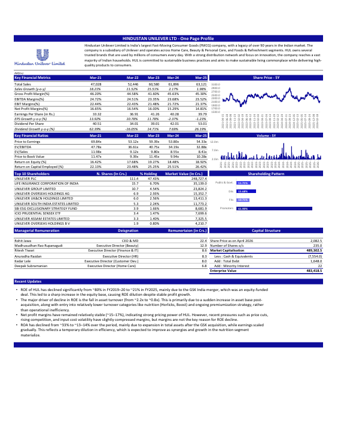
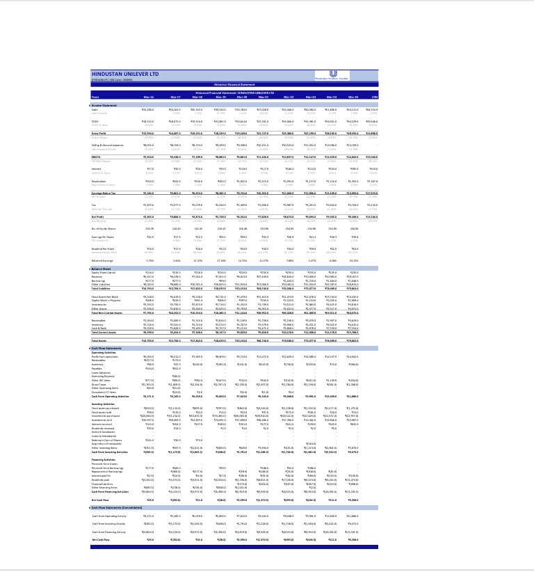
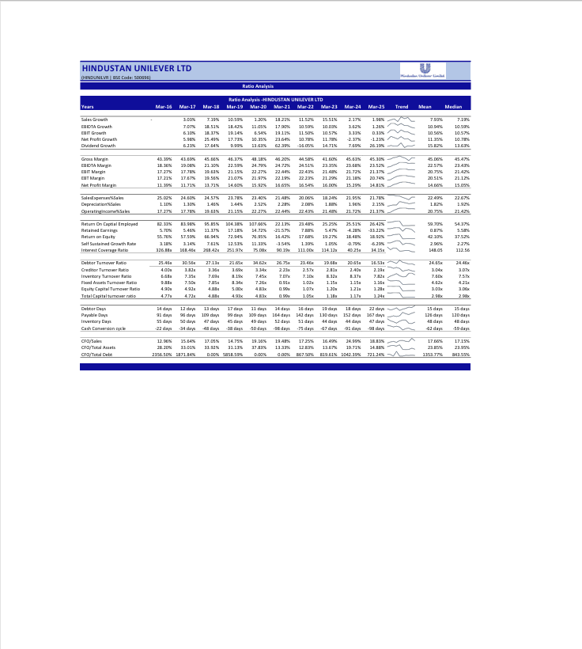
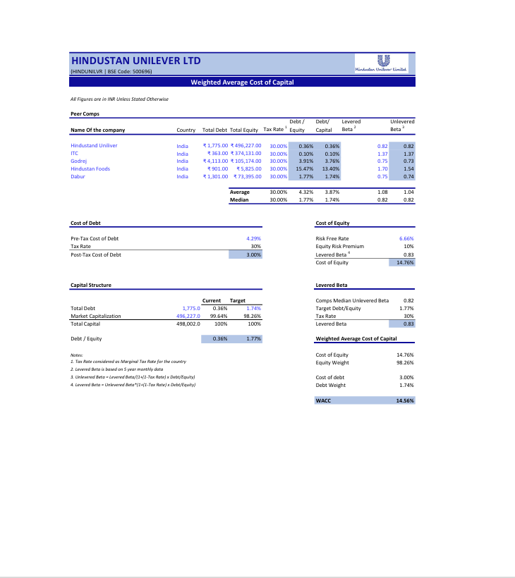
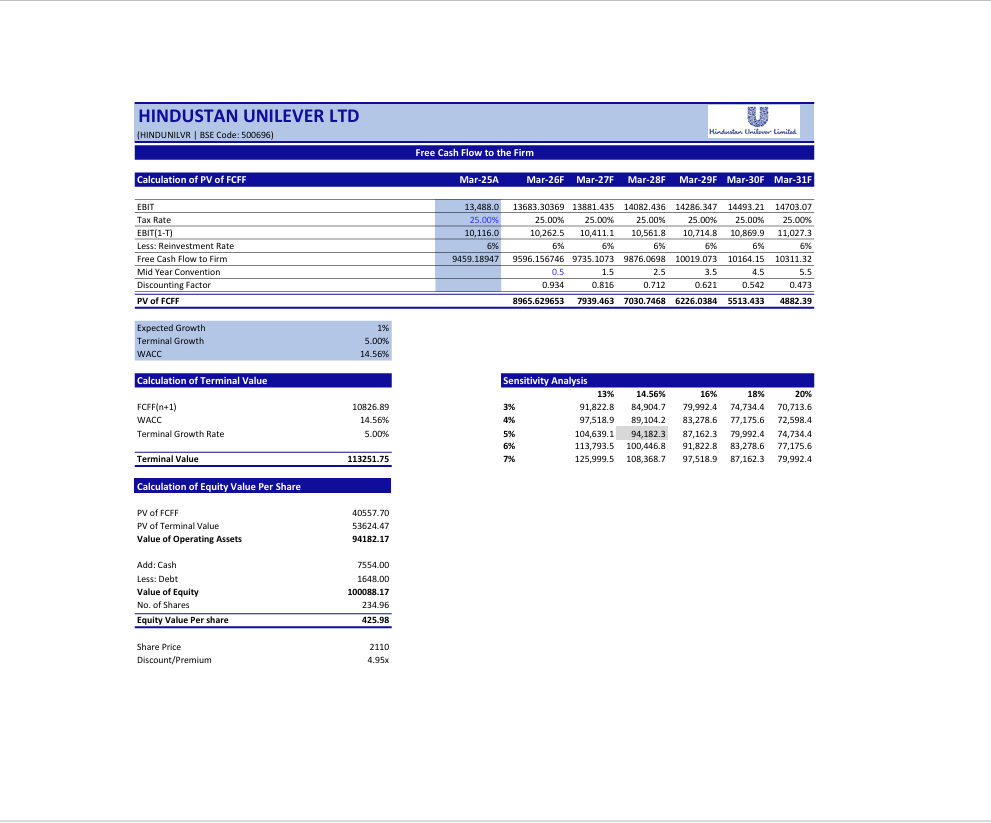
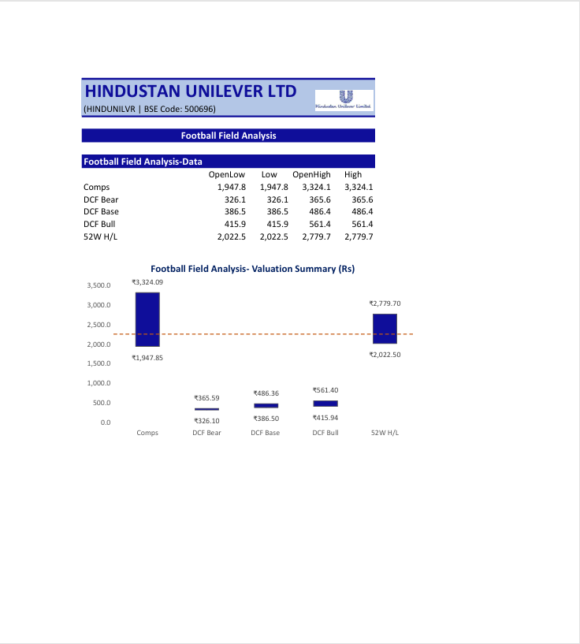
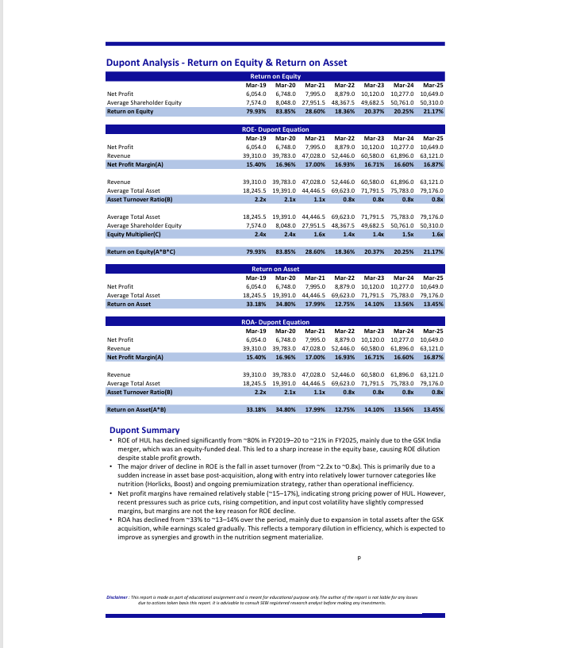

# 📊 Hindustan Unilever Limited — Financial Modeling & Valuation


> **A comprehensive financial model on Hindustan Unilever Limited (NSE: HINDUNILVR | BSE: 500696) covering 10 years of historical data, three-scenario forecasting, intrinsic valuation (DCF/FCFF), comparable companies analysis, DuPont decomposition, Altman Z-Score, and Value at Risk — built entirely in Microsoft Excel.**

---

## 📁 Repository Contents

```
HUL-Financial-Modeling/
├── HUL_Financial_Model.xlsx              # Master Excel workbook (11 analysis tabs)
├── HUL_Financial_Modeling_Report.pdf    # Full formatted PDF report
├── README.md                            # Project documentation


```

---

## 📌 Project Overview

This is an end-to-end equity research and financial modeling project on **Hindustan Unilever Limited (HUL)**, India's largest FMCG company and a subsidiary of Unilever PLC. The model covers the full spectrum of financial analysis used by analysts at investment banks, Big 4 firms, and equity research desks — from raw data sourcing to a final valuation opinion.

| Detail | Info |
|--------|------|
| **Company** | Hindustan Unilever Limited |
| **Ticker** | NSE: HINDUNILVR \| BSE: 500696 |
| **Sector** | FMCG (Fast-Moving Consumer Goods) |
| **Historical Period** | FY2016 – FY2025 (10 years) |
| **Forecast Period** | FY2026E – FY2030E (5 years) |
| **Valuation Date** | April 2026 |
| **CMP (at Valuation)** | ₹ 2,082.5 |
| **Data Sources** | Screener.in, NSE/BSE, Damodaran ERP Database |
| **Tool** | Microsoft Excel |

---

## 🗂️ Table of Contents

| # | Section | Description |
|---|---------|-------------|
| 1 | One Page Profile | Executive summary — financials, ratios, shareholding, capital structure |
| 2 | Historical Financial Statement | 10-year Income Statement, Balance Sheet & Cash Flow |
| 3 | Forecasting Analysis | Weighted average-based Sales, EBITDA & EPS projections to FY2030E |
| 4 | Common Size Statement | Vertical analysis — all line items as % of Revenue / Total Assets |
| 5 | Ratio Analysis | 15+ ratios across growth, profitability, efficiency, leverage & cash quality |
| 6 | Beta Drifting & WACC | OLS regression beta, peer unlever/relever, CAPM cost of equity, WACC |
| 7 | DCF Valuation (FCFF) | ROIC, reinvestment rate, FCFF projection, terminal value, equity value/share |
| 8 | Comparable Companies Valuation | EV/Revenue, EV/EBITDA, P/E comps across 9 FMCG peers + football field |
| 9 | DuPont Analysis | Three-factor ROE & ROA decomposition (FY2019–FY2025) |
| 10 | Altman's Z-Score | Credit risk scoring across 7 years |
| 11 | VAR — Value at Risk | Historical simulation & Monte Carlo VAR at 90%, 95%, 99%, 99.5% CI |

---

## 📸 Screenshots

### One Page Profile


### Historical Financial Statement


### Ratio Analysis


### Beta Drifting & WACC


### DCF Valuation


### Football Field — Valuation Summary


### DuPont Analysis


---

## 📐 Ratio Analysis (FY2016–FY2025)

### Growth Metrics

| Ratio | FY17 | FY18 | FY19 | FY20 | FY21 | FY22 | FY23 | FY24 | FY25 | Mean | Median |
|-------|------|------|------|------|------|------|------|------|------|------|--------|
| Sales Growth | 3.03% | 7.19% | 10.59% | 1.20% | 18.21% | 11.52% | 15.51% | 2.17% | 1.98% | 7.93% | 7.19% |
| EBITDA Growth | 7.07% | 18.51% | 18.42% | 11.05% | 17.90% | 10.59% | 10.03% | 3.62% | 1.26% | 10.94% | 10.59% |
| EBIT Growth | 6.10% | 18.37% | 19.14% | 6.54% | 19.11% | 11.50% | 10.57% | 3.33% | 0.33% | 10.56% | 10.57% |
| Net Profit Growth | 5.98% | 25.49% | 17.73% | 10.35% | 23.64% | 10.78% | 11.78% | -2.37% | -1.23% | 11.35% | 10.78% |

### Profitability Margins

| Ratio | FY16 | FY17 | FY18 | FY19 | FY20 | FY21 | FY22 | FY23 | FY24 | FY25 | Mean | Median |
|-------|------|------|------|------|------|------|------|------|------|------|------|--------|
| Gross Margin | 43.39% | 43.69% | 45.66% | 46.37% | 48.18% | 46.20% | 44.58% | 41.60% | 45.63% | 45.30% | 45.06% | 45.47% |
| EBITDA Margin | 18.36% | 19.08% | 21.10% | 22.59% | 24.79% | 24.72% | 24.51% | 23.35% | 23.68% | 23.52% | 22.57% | 23.43% |
| EBIT Margin | 17.27% | 17.78% | 19.63% | 21.15% | 22.27% | 22.44% | 22.43% | 21.48% | 21.72% | 21.37% | 20.75% | 21.42% |
| Net Profit Margin | 11.39% | 11.71% | 13.71% | 14.60% | 15.92% | 16.65% | 16.54% | 16.00% | 15.29% | 14.81% | 14.66% | 15.05% |

### Returns & Capital Efficiency

| Ratio | FY16 | FY17 | FY18 | FY19 | FY20 | FY21 | FY22 | FY23 | FY24 | FY25 | Mean | Median |
|-------|------|------|------|------|------|------|------|------|------|------|------|--------|
| ROE | 55.76% | 57.59% | 66.94% | 72.94% | 76.95% | 16.42% | 17.68% | 19.27% | 18.48% | 18.92% | 42.10% | 37.52% |
| ROCE | 82.33% | 83.98% | 95.85% | 104.38% | 107.66% | 22.13% | 23.48% | 25.25% | 25.51% | 26.42% | 59.70% | 54.37% |
| Self-Sustained Growth Rate | 3.18% | 3.14% | 7.61% | 12.53% | 11.33% | -3.54% | 1.39% | 1.05% | -0.79% | -6.29% | 2.96% | 2.27% |

### Efficiency & Turnover

| Ratio | FY16 | FY17 | FY18 | FY19 | FY20 | FY21 | FY22 | FY23 | FY24 | FY25 | Mean | Median |
|-------|------|------|------|------|------|------|------|------|------|------|------|--------|
| Interest Coverage | 326.88x | 168.46x | 268.42x | 251.97x | 75.08x | 90.19x | 111.00x | 114.12x | 40.25x | 34.15x | 148.05x | 112.56x |
| Debtor Turnover | 25.46x | 30.56x | 27.13x | 21.65x | 34.62x | 26.75x | 23.46x | 19.68x | 20.65x | 16.53x | 24.65x | 24.46x |
| Inventory Turnover | 6.68x | 7.35x | 7.69x | 8.19x | 7.45x | 7.07x | 7.10x | 8.32x | 8.37x | 7.82x | 7.60x | 7.57x |
| Fixed Assets Turnover | 9.88x | 7.50x | 7.85x | 8.34x | 7.26x | 0.91x | 1.02x | 1.15x | 1.15x | 1.16x | 4.62x | 4.21x |

### Working Capital & Cash Quality

| Ratio | FY16 | FY17 | FY18 | FY19 | FY20 | FY21 | FY22 | FY23 | FY24 | FY25 | Mean | Median |
|-------|------|------|------|------|------|------|------|------|------|------|------|--------|
| Debtor Days | 14d | 12d | 13d | 17d | 11d | 14d | 16d | 19d | 18d | 22d | 15d | 15d |
| Payable Days | 91d | 96d | 109d | 99d | 109d | 164d | 142d | 130d | 152d | 167d | 126d | 120d |
| Inventory Days | 55d | 50d | 47d | 45d | 49d | 52d | 51d | 44d | 44d | 47d | 48d | 48d |
| Cash Conversion Cycle | -22d | -34d | -48d | -38d | -50d | -98d | -75d | -67d | -91d | -98d | -62d | -59d |
| CFO / Sales | 12.96% | 15.64% | 17.05% | 14.75% | 19.16% | 19.48% | 17.25% | 16.49% | 24.99% | 18.83% | 17.66% | 17.15% |
| CFO / Total Assets | 28.20% | 33.01% | 33.92% | 31.13% | 37.83% | 13.33% | 12.83% | 13.67% | 19.71% | 14.88% | 23.85% | 23.95% |

> **Standout observation:** HUL's Cash Conversion Cycle has been **deeply negative throughout** — reaching -98 days in FY25. This means HUL collects from customers and holds inventory far faster than it pays suppliers, effectively using supplier credit as a free source of working capital financing. This is a hallmark of FMCG dominance.

---

## 📊 Key Financial Data

### Historical Performance (FY2021–FY2025)

| Metric | FY2021 | FY2022 | FY2023 | FY2024 | FY2025 |
|--------|--------|--------|--------|--------|--------|
| Revenue (₹ Crs.) | 47,028 | 52,446 | 60,580 | 61,896 | 63,121 |
| Revenue Growth | 18.21% | 11.52% | 15.51% | 2.17% | 1.98% |
| Gross Margin | 46.20% | 44.58% | 41.60% | 45.63% | 45.30% |
| EBITDA Margin | 24.72% | 24.51% | 23.35% | 23.68% | 23.52% |
| Net Profit Margin | 16.65% | 16.54% | 16.00% | 15.29% | 14.81% |
| EPS (₹) | 33.32 | 36.91 | 41.26 | 40.28 | 39.79 |
| ROE | 16.42% | 17.68% | 19.27% | 18.48% | 18.92% |
| ROCE | 22.13% | 23.48% | 25.25% | 25.51% | 26.42% |

### Forecast Summary (FY2026E–FY2030E)

| Year | Revenue (₹ Crs.) | Growth | EBITDA (₹ Crs.) | EPS (₹) |
|------|-----------------|--------|-----------------|---------|
| FY26E | 68,218 | 8.08% | 16,849 | 46.8 |
| FY27E | 72,166 | 5.79% | 17,975 | 49.8 |
| FY28E | 76,114 | 5.47% | 19,100 | 52.8 |
| FY29E | 80,062 | 5.19% | 20,225 | 55.8 |
| FY30E | 84,010 | 4.93% | 21,350 | 58.7 |

---

## 💹 Valuation Summary

### WACC Inputs

| Component | Value |
|-----------|-------|
| Risk-Free Rate (10Y G-Sec) | 6.66% |
| Equity Risk Premium (Damodaran) | 10.00% |
| Re-levered Beta | 0.83 |
| Cost of Equity (CAPM) | 14.76% |
| Post-Tax Cost of Debt | 3.00% |
| **WACC** | **14.56%** |

### DCF Output

| Component | Value (₹ Crs.) |
|-----------|---------------|
| PV of FCFF (6 years) | 40,558 |
| PV of Terminal Value | 53,624 |
| Value of Operating Assets | 94,182 |
| Add: Cash | 7,554 |
| Less: Debt | 1,648 |
| **Equity Value** | **1,00,088** |
| **Intrinsic Value Per Share** | **₹ 425.98** |
| CMP | ₹ 2,110 |
| **Premium to Intrinsic Value** | **~4.95x** |

### Comps Valuation

| Multiple | Median | Implied Value/Share | vs. CMP |
|---------|--------|---------------------|---------|
| EV/Revenue | 7.0x | ₹ 1,947.8 | Overvalued |
| EV/EBITDA | 35.7x | ₹ 2,433.6 | Undervalued |
| P/E | 53.7x | ₹ 3,324.1 | Undervalued |

### Football Field

```
Comps       ₹1,948 ──────────────────────────────── ₹3,324
DCF Bear    ₹326 ─── ₹366
DCF Base    ₹387 ──────── ₹486
DCF Bull    ₹416 ──────────── ₹561
52W H/L     ₹2,023 ─────────────────── ₹2,780
                          │
                      CMP ₹2,110
```

---

## 🔑 Key Insights

**1. HUL trades at a large premium to DCF intrinsic value (~4.95x)**
This is not unusual for HUL — the market consistently prices in its brand moat, distribution network, and near-certainty of cash flows. DCF captures accounting intrinsic value, not franchise premium.

**2. ROE declined from ~80% to ~21% — but for the right reason**
The collapse was driven entirely by asset turnover falling from 2.2x to 0.8x after the GSK-Horlicks acquisition tripled the equity base. Net margins (~16–17%) have remained stable, confirming no operational deterioration.

**3. ROCE is actually improving** — from 22.13% (FY21) to 26.42% (FY25) — indicating that new capital deployed post-acquisition is generating returns above cost of capital.

**4. On P/E and EV/EBITDA basis, HUL looks undervalued vs. peers** — driven by ITC's disproportionately low multiples pulling the median down. On a quality-adjusted basis, HUL's premium is justified.

**5. Financial health is exceptional** — Altman Z-Score of 12+ (well above distress threshold of 1.81), negative cash conversion cycle (-98 days in FY25), and negligible debt.

---

## 🛠️ Tools & Data Sources

| | Detail |
|-|--------|
| **Modeling** | Microsoft Excel (Data Analysis Toolpak for OLS regression) |
| **Financial Data** | [Screener.in](https://www.screener.in/company/HINDUNILVR/consolidated/) |
| **Market / Price Data** | NSE India, BSE India |
| **Equity Risk Premium** | [Damodaran Online](http://pages.stern.nyu.edu/~adamodar/) |
| **Peer Benchmarking** | Screener.in, The Valuation School |

---

## 👤 Author

**Yash Mishra**  
B.Voc (BFSI) — Ramanujan College, University of Delhi | CGPA: 8.50  
NISM Series XV Certified

[](https://www.linkedin.com/in/yashsimplifyingideas/)

---

## ⚠️ Disclaimer

This project was built as part of an academic and self-learning portfolio exercise. It is intended for educational purposes only. The analysis, valuations, and conclusions do not constitute investment advice. The author is not liable for any investment decisions made based on this report. Please consult a SEBI-registered research analyst before making any investment decisions.

---
*Last updated: June 2026*
